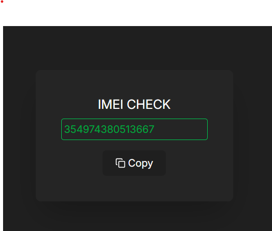
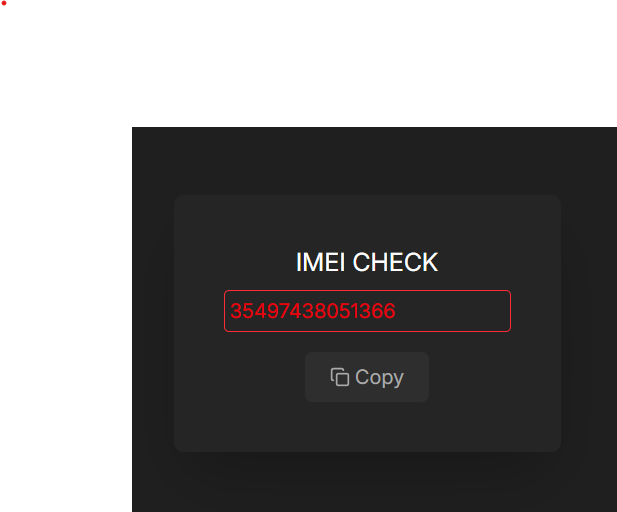

# 🔍 Verificador de IMEI

O IMEI Checker é uma aplicação simples e intuitiva para validar números de IMEI e serial. Ele verifica se o IMEI tem exatamente 15 dígitos e o serial tem até 11 caracteres, fornecendo feedback visual em tempo real.

## Como funciona?

O IMEI Checker é uma ferramenta simples e eficiente para validar números de IMEI. Ele foi desenvolvido para garantir que o IMEI tenha exatamente 15 dígitos. A aplicação fornece feedback visual em tempo real, ajudando o usuário a identificar rapidamente se os valores inseridos são válidos ou não.

Quando o usuário digita o IMEI, a aplicação remove automaticamente qualquer caractere que não seja um número, garantindo que apenas dígitos sejam aceitos. O campo do IMEI só permite a entrada de até 15 dígitos. Conforme o usuário digita, a borda do input muda de cor para indicar o status:#

- Borda Branca: O campo está vazio.
- Borda Vermelha: O IMEI tem menos de 15 dígitos (inválido).
- Borda Verde: O IMEI tem exatamente 15 dígitos (válido).

O botão "Copy" só fica habilitado quando o IMEI é válido (15 dígitos). Ao clicar no botão, o IMEI é copiado para a área de transferência. Se o IMEI for inválido e o usuário tentar clicar no botão, o input do IMEI balança (shake animation), fornecendo um feedback visual de que algo está errado.

## Tecnologias Utilizadas
- **React**
- **TypeScript**
- **Tailwind CSS**
- **Lucide Icons**
- **Vite**

  
## Aplicação funcionando




## Como Rodar o Projeto

### Pré-requisitos
- **NodeJS** (v16 ou superior)
- **npm, yarn ou pnpm** 

### Como executar
1. Clone este repositório:
  ```bash
   git clone https://github.com/jonasmfernandes/imeiCheck.git
  ```
2. Acesse a pasta do projeto:
  ```bash
   cd imeiCheck
  ```
3. Rode a aplicação no seu navegador:
```bash
  npm run dev
```

## Autor 
Desenvolvido por: Jonas Monteiro Fernandes

## Licença
Este projeto está protegido pela licença MIT.